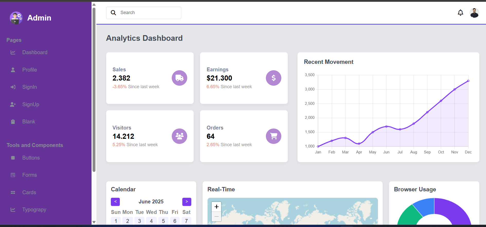

# Admin Dashboard

A responsive admin dashboard built with **HTML**, **CSS**, **JavaScript**, and **Chart.js**. The dashboard includes a sidebar navigation, interactive charts, a calendar, and a real-time map.

## Features

- Sidebar navigation with icons
- Responsive layout for desktop, tablet, and mobile
- Sales, Earnings, Visitors, and Orders summary cards
- Line chart showing recent activity
- Doughnut chart for browser usage
- Interactive calendar component
- Embedded real-time map using OpenStreetMap
- Mobile-friendly hamburger menu

## Folder Structure

```

project/
│
├── index.html # Main HTML file
├── style.css # Stylesheet for the dashboard
├── images/ # Folder for images (logo, profile, etc.)

```

## Technologies Used

- HTML5
- CSS3 (Flexbox + Grid)
- JavaScript (Vanilla)
- Chart.js (for charts)
- jQuery (for menu toggle)
- Font Awesome (for icons)
- OpenStreetMap (for map iframe)

## Responsiveness

- Sidebar collapses on smaller screens
- Cards and charts adjust to mobile and tablet sizes
- Hamburger menu for mobile navigation

## How to Use

1. Clone or download the repository.
2. Open `index.html` in a browser.
3. Explore the dashboard and test responsiveness on different screen sizes.

## Screenshots

### Desktop View


